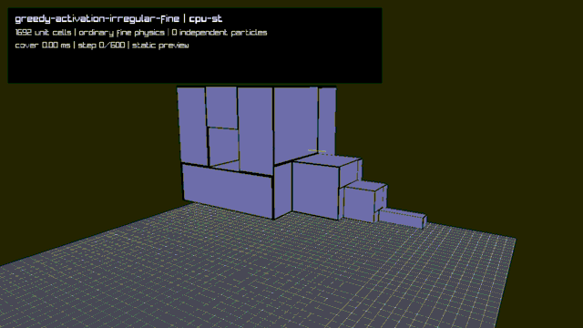
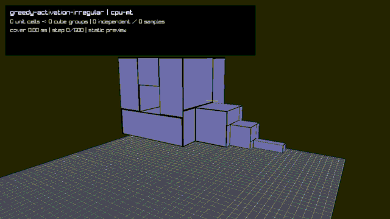
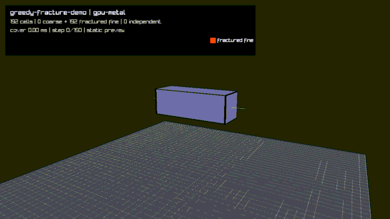

# Greedy multiscale solver: implementation status

This document describes the greedy solver on the `coarse` branch at commit
`10b74d9`. It records the implementation developed on this branch, how it
differs from the original unit-voxel solver, and the measurements and visual
artifacts already produced during development. The numbers below are existing
results; this document did not rerun the benchmarks or regenerate the GIFs.

## Purpose and representation

The original solver creates one eight-corner PBD shape for every activated unit
voxel. The greedy path keeps every unit voxel as real material and render
geometry, but covers a connected static component with larger integer cubes.
Each cover cube contributes one parent VGS shape. This reduces integrated
degrees of freedom and shape constraints without changing the static grid's
unit spacing or deleting the fine material representation.

Activation is opt-in through `--activation-cubes=greedy` and works with
`cpu-st`, `cpu-mt`, `gpu-gl43`, and `gpu-metal`. The cover is built on the CPU
by `greedy_cube_cover_build()` in `greedy_cube_cover.inc`. It scans deterministic
boundary-corner/octant candidates, grows cubes by checking the three new shell
faces, and breaks equal-size ties by coordinate and octant order. Compatible
voxel types are covered separately.

`greedy_coarse_bind()` in `greedy_coarse.inc` constructs the runtime topology:

- **Parent controls** are the eight corners of each greedy cube. They are
  ordinary solver particles and use the existing integration, collision,
  correction-apply, and VGS code.
- **Passive child points** are trilinearly derived from their owning parent.
  They do not integrate, collide, or add VGS constraints.
- **Promoted interface points** occur when one parent's corner lies in another
  parent's derived geometry. They are independent solver particles connected
  to the owner by an interpolation attachment.
- **Unit children** retain identity, color, gameplay and restoration metadata,
  surface geometry, and pointer glue. They are refreshed from the solved
  controls for rendering and lifecycle operations.

Ownership is assigned from larger cubes to smaller cubes, with coordinate order
breaking equal-size ties. Passive dependency rows are flattened once when the
topology is built. Material mass is accumulated once and distributed to the
independent controls; derived points receive no duplicate gravity or mass.

## Solver pipeline

The CPU ST and CPU MT implementations reuse the original particle lists,
spatial hash, Jacobi correction accumulators, VGS formulation, static-contact
solver, velocity update, and persistent worker pool. The principal change is
that VGS traverses `greedyCoarse.physics_shapes`, which contains coarse parents
plus any ordinary fine voxels outside the cover. Passive children never enter
that list.

The OpenGL 4.3 and Metal backends share the packing and dispatch logic in
`physics_gpu_common.inc` and matching GLSL/Metal kernels. Parent corners take
the original direct VGS and collision paths. Promoted interfaces are expressed
as ordinary Jacobi attachment constraints: attachment kernels emit corrections
into the original correction buffer and the normal apply kernel commits them.
Passive rows are used by dependency refresh and rendering, not by VGS.

GPU execution also includes these branch-specific changes:

- Several fixed steps can run in one command buffer. The irregular benchmark
  uses eight-step batches.
- Floor, world-bound, and player-box contact are separated from static-grid
  contact. Small dependency islands use an ordered, threadgroup-memory floor
  solver; terrain and blocks retain the general static-contact kernel.
- Child instance matrices are generated from GPU-resident particle state.
  Metal passes that buffer directly to instanced rendering, avoiding a complete
  passive-child readback for drawing.
- Collision samples are exposed parent corners and ordinary fine particles.
  Parent collision radius scales with parent edge length, while passive child
  points do not collide.

The common high-level order remains prediction, dynamic hash/contact, Jacobi
apply, VGS/apply iterations, attachment/apply iterations, static contact,
velocity finalization, dependency refresh, and voxel/render-state update.

## Reuse and divergences from the original solver

| Area | Original unit-voxel solver | Greedy solver on this branch |
|---|---|---|
| Material representation | One live PBD shape per unit voxel | Unit children remain allocated, but greedy parents provide most live shapes |
| Degrees of freedom | Every shared unit-grid corner may integrate | Parent controls and promoted interfaces integrate; passive points are derived |
| Shape constraints | VGS for every active unit voxel | The same VGS kernel over coarse parents and uncovered fine voxels |
| Correction application | Original Jacobi accumulators/apply pass | Same direct path for parents; GPU attachments also use the same pipeline |
| CPU parallelism | Worker-pool integration, contacts, VGS, and apply | Same worker pool and prepared physics-shape list |
| Dynamic contacts | Spatial hash over ordinary collision particles | Same hash over exposed parent controls and ordinary fine particles, with scaled radii |
| Static contacts | One general pass per substep | CPU retains that pass; GPU has a specialized ordered floor path plus the general terrain/block path |
| Interface coupling | Shared particle pointers | Promoted particle plus interpolation attachment where resolutions meet |
| Rendering | Voxel transforms from ordinary particle state | Fine children remain visible; GPU can build their transforms from resident state |
| Activation/cover | Direct unit-voxel activation | CPU collects the component, creates children, computes the greedy cover, and binds parents |
| Fracture | Break mask, pointer clone/split, topology rebuild in the active backend | Greedy refreshes children, detects the local break, materializes the seam, uses the original CPU pointer splitter, then recoarsens intact material |
| Sleeping/waking | Original cluster lifecycle and native GPU wake/topology kernels | Wake decisions and greedy rebuild are currently CPU-side; direct bullet, melee, and tether wakes now request a greedy rebuild |
| GPU topology | Break, split, wake, and union/relabel kernels remain resident | The original GPU break/wake/topology kernels are explicitly bypassed for greedy mode |
| Memory reduction | No coarsening | Reduces active controls and constraints, but still allocates all fine children and their render samples |

The scale-independent parts of the old solver are therefore already reused:
integration, direct particle correction, VGS geometry, dynamic hashing,
ordinary static contact, velocity finalization, and CPU parallel dispatch. Most
remaining differences come from constructing and maintaining the parent/child
topology rather than from voxel scale itself.

## Lifecycle and topology status

Static activation and greedy cover construction run on the CPU. Removing or
rebuilding a greedy group first refreshes and materializes its children, then
reuses the ordinary voxel lifecycle code. The materialization handoff corrects
velocity to preserve total linear and angular momentum.

Fracture is functional on CPU and GPU-backed gameplay, but it is not a native
GPU topology operation. After a Metal/OpenGL batch completes, the CPU refreshes
the unit children, evaluates their break masks, materializes the affected seam,
runs the original pointer-based face split, and covers the unaffected children
again. The seam remains ordinary fine physics and the next GPU batch uploads
the resulting mixed fine/coarse topology.

Sleeping-cluster wake is also CPU-owned. Proximity waking already wakes the
connected child cluster and rebuilds the current greedy cover once after its
scan. Bullet, melee, tether-start, held-tether, and tether-release paths now go
through `wake_sleeping_cluster_for_gameplay()`, which calls the original cluster
wake and immediately invokes `greedy_rebuild_current()` when greedy mode is
active.

Current lifecycle limitations are:

- Greedy wake timers are updated on the CPU after a GPU batch.
- Greedy GPU dispatch skips the original break-mask, split, wake-gather,
  wake-apply, and topology-rebuild kernels.
- A GPU fracture becomes visible after the current fixed-step batch and forces
  a resident-state repack for the next batch.
- `GreedyCoarseSystem` is a single global topology. A rebuild covers its current
  material rather than updating independent per-island arenas.
- Fine children remain allocated, so the main memory saving is in active solver
  state and constraints rather than total voxel storage.

## Existing measurements

The main irregular fixture contains 1,692 material cells. It shows the static
body for 20 fixed steps and then measures 600 simulated steps. The greedy cover
produced 113 parents with integer edge sizes 1 through 5. The original measured
topology had 2,324 fine samples and 177 independent controls, versus 2,335
independent particles in the fine CPU fixture. Cover construction took about
187–191 ms on the development Apple M2 Pro.

### Historical mapped-interface baseline

These September 8 measurements predate promoted interface particles and are
retained to show the initial performance profile. Each entry is the median and
range of three measured runs after one warm-up.

| Backend | Fine, 600 steps | Greedy, 600 steps | Greedy speedup |
|---|---:|---:|---:|
| CPU ST | 2,242.56 ms (2,236.27–2,244.56) | 979.47 ms (975.15–980.83) | 2.29× |
| CPU MT | 2,019.33 ms (1,982.02–2,108.31) | 1,293.57 ms (1,290.81–1,294.73) | 1.56× |
| Metal, one-step batches | 2,700.35 ms (2,687.83–2,700.98) | 3,697.08 ms (3,693.52–3,712.95) | 0.73× |

In that CPU ST profile, dynamic contact generation cost about 573 ms and VGS
about 185 ms. This showed that reducing VGS constraints alone did not eliminate
the fine collision-sample cost.

### Later GPU and batching measurements

After GPU-resident child rendering and fixed-step batching, three existing
eight-step-batch runs measured:

| Backend/configuration | Fine median (range) | Greedy median (range) | Greedy speedup |
|---|---:|---:|---:|
| Metal, eight-step batches | 3,672.77 ms (3,655.55–4,315.08) | 2,959.69 ms (2,956.29–2,991.17) | 1.24× |

The existing clean greedy-only comparison recorded CPU MT at 1,435.69 ms
(1,426.05–1,537.88) and Metal at 2,923.74 ms
(2,894.18–2,924.43). On that workload Metal remained about 2.04 times slower
than CPU MT even though it beat the corresponding fine Metal fixture.

An uninstrumented Metal GPU-timestamp invariant run recorded 1,786.62 ms. A
separate stage-profile run, whose counter sampling changes scheduling, recorded
3,057.28 ms: attachment evaluation used 47.98%, correction application 17.52%,
pair contact 14.53%, and direct VGS 5.47%. Replacing the former ordered
Gauss-Seidel attachment implementation with ordinary Jacobi attachment
constraints reduced that invariant run by 32.4% relative to its 2,641.54 ms
direct baseline. These profiling results explain relative costs and should not
be compared directly with the end-to-end benchmark table.

The later local-fracture Metal capture covered 192 cells. After the scripted
crack, 188 cells remained in 36 greedy groups and four seam cells remained fine;
the report recorded 114 independent particles, 39 promoted interfaces, and 39
attachments. Its 130 simulated steps took 269.17 ms in the captured run.

## Existing visual results

The colors in greedy captures identify parent cube size. The fine comparison
uses ordinary unit physics. These files were generated during development and
are embedded here without modification.

### Ordinary fine CPU comparison

### Greedy CPU ST

### Greedy CPU MT

### Greedy Metal with GPU-resident child rendering

### Greedy Metal local fracture

Red marks the locally materialized fine seam; the rest of the object remains
covered by coarse parents.

## Relevant implementation files

- `greedy_cube_cover.inc`: deterministic integer cube cover.
- `greedy_coarse.inc`: ownership, mass, dependencies, attachments, collision
  samples, materialization, rebuild, and local fracture.
- `physics_gpu_common.inc`: shared GPU packing, batching, floor islands,
  attachment dispatch, resident rendering, readback, and fallback behavior.
- `shaders/pbd/pbd_pipeline.comp` and `pbd_pipeline.metal`: matching OpenGL and
  Metal solver kernels.
- `debug_greedy.inc`: irregular and fracture fixtures, metrics, and validation.
- `tests/sized_physics_test.c`: cover, ownership, transfer, lifecycle,
  fracture, collision, and backend invariants.

The earlier experiment notes and command examples remain in
`docs/greedy-cube-activation.md`.
